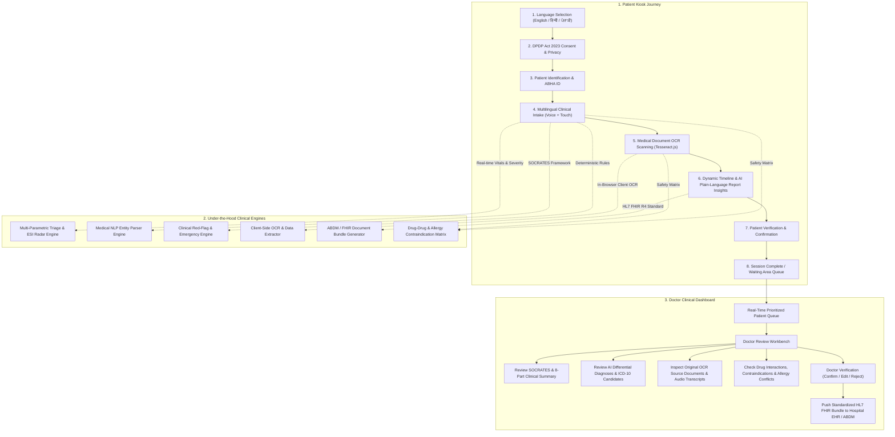

# 🏥 ArogyaDarpan (MediKiosk) — Complete Platform Architecture & Workflow

> **Core Philosophy:** *"AI Prepares. AI Explains. The Doctor Decides."*
> 
> ArogyaDarpan is an **AI-Assisted Smart OPD Clinical Intake & Triage Kiosk System** designed to streamline hospital outpatient queues in India. It assists physicians by automating clinical history elicitation, document digitization, emergency triage calculation, and ABDM/FHIR export without ever making autonomous medical decisions.

---

## 🗺️ System Architecture & Workflow Flowchart



---

## 📁 Complete Codebase Structure & File Tree

```
arogyadarpan/
├── index.html                      # Single page entry point with Google Fonts
├── package.json                    # Dependencies (React, Vite, Tailwind v4, Lucide, Framer Motion, Tesseract.js)
├── vite.config.js                  # Vite bundler configuration
│
├── src/                            # FRONTEND APPLICATION SOURCE
│   ├── main.jsx                    # React root renderer
│   ├── App.jsx                     # Router, route transitions (AnimatePresence), route guard redirects
│   ├── index.css                   # Tailwind v4 theme, HSL medical color palette, animation tokens
│   │
│   ├── pages/                      # ROUTE PAGES
│   │   ├── LandingPage.jsx         # Public landing page with kiosk launcher & demo entry
│   │   ├── DemoPage.jsx            # Quick Demo selection portal (Patient vs Doctor journeys)
│   │   │
│   │   ├── patient/                # PATIENT KIOSK INTAKE FLOW
│   │   │   ├── LanguageSelection.jsx    # Step 1: Language selection (English, Hindi, Punjabi)
│   │   │   ├── ConsentScreen.jsx        # Step 2: DPDP Act 2023 & ABDM consent with audio read-aloud
│   │   │   ├── PatientIdentification.jsx# Step 3: Patient demographic details, phone validation & ABHA ID
│   │   │   ├── InterviewScreen.jsx      # Step 4: Voice/touch intake, SOCRATES, AYUSH track & live radar
│   │   │   ├── DocumentUpload.jsx       # Step 5: Prescription & lab report scanning with client OCR
│   │   │   ├── DocumentReview.jsx       # Step 6: Dynamic medical timeline & plain-language AI report insights
│   │   │   ├── ConfirmationScreen.jsx   # Step 7: Patient verification checklist & allergy conflict flag
│   │   │   └── CompletionScreen.jsx     # Step 8: Session complete with new session reset option
│   │   │
│   │   └── doctor/                 # DOCTOR DASHBOARD & CLINICAL WORKBENCH
│   │       ├── DoctorDashboard.jsx      # Triage-sorted OPD queue with search and status filters
│   │       └── PatientDetail.jsx        # 8-part SIH summary, AYUSH tab, ICD-10 differentials & FHIR export
│   │
│   ├── components/                 # REUSABLE UI & CLINICAL COMPONENTS
│   │   ├── Button.jsx              # Accessible button with primary/secondary/ghost/danger variants
│   │   ├── Card.jsx                # Glassmorphic card container with hover & active ring states
│   │   ├── Badge.jsx               # Severity & status badge with color coding (critical/warning/success)
│   │   ├── ConfidenceBadge.jsx     # Visual confidence indicator for AI-extracted entities (e.g. 96%)
│   │   ├── ClinicalSignalCard.jsx  # Red-flag alert card with source citation and disclaimer
│   │   ├── SymptomRadarCard.jsx    # Real-time multi-symptom triage radar with ESI severity level
│   │   ├── CompletenessTracker.jsx # Visual checklist tracking all required clinical history categories
│   │   ├── AYUSHModeToggle.jsx     # Toggle switch between Modern Medicine & Ayurvedic examination
│   │   ├── VoiceRecorder.jsx       # Audio recording button with animated audio wavebars
│   │   ├── Timeline.jsx            # Vertical interactive patient health history timeline
│   │   ├── VerificationButtons.jsx # Doctor "Confirm / Edit / Reject" interactive controls
│   │   ├── DrugSafetyBanner.jsx    # Real-time drug-drug & allergy contraindication warnings
│   │   ├── DifferentialDiagnosisWidget.jsx # AI differential diagnosis ranking with ICD-10 codes
│   │   ├── EvidenceDrawer.jsx      # Slide-over panel showing verbatim OCR text / voice transcripts
│   │   ├── DocumentInspectorModal.jsx # Full-screen modal for inspecting uploaded medical records
│   │   ├── KioskView.jsx           # Fullscreen physical kiosk station mode wrapper
│   │   ├── ConnectionStatus.jsx    # Real-time offline/online & backend sync indicator
│   │   ├── LoadingState.jsx        # Skeleton loader and pulsing medical spinner
│   │   └── ProgressBar.jsx         # Smooth animated multi-step progress indicator
│   │
│   ├── hooks/                      # CUSTOM REACT HOOKS
│   │   ├── useInterview.js         # Manages adaptive question sequence, completeness, & triage state
│   │   └── useVoiceInput.js        # Web Speech API wrapper with multilingual STT & fallback handling
│   │
│   ├── services/                   # CORE CLINICAL INTELLIGENCE ENGINES
│   │   ├── clinicalRules.js        # Deterministic emergency red-flag rules (no LLM hallucinations)
│   │   ├── triageEngine.js         # Multi-parametric ESI Level 1-5 classification & risk scoring
│   │   ├── medicalParserService.js # Clinical NLP entity extractor for symptoms, drugs, & lab tests
│   │   ├── ocrEngine.js            # Tesseract.js in-browser OCR scanner with date extraction
│   │   ├── drugInteractionEngine.js# Drug-drug interaction & allergy contraindication matrix
│   │   ├── differentialEngine.js   # AI differential diagnosis generator with ICD-10 mapping
│   │   ├── reportInsightEngine.js  # Plain-language report explanation & curative guidance
│   │   ├── abdmService.js          # Standardized HL7 FHIR R4 document bundle generator
│   │   └── sessionStore.js         # LocalStorage reactive store, label formatter, & timeline builder
│   │
│   └── data/                       # CLINICAL ONTOLOGIES & DEMO DATA
│       ├── questionBank.js         # SOCRATES pain trees, AYUSH Dashavidha questions, ROS questions
│       └── demoPatients.js         # Pre-loaded clinical profiles (Rahul Sharma, Sunita Devi, etc.)
│
└── backend/                        # EXPRESS / NODE.JS REST API (Optional Standalone Server)
    ├── server.js                   # Express server entry point (Port 5000) with CORS & file uploads
    ├── package.json                # Express, Mongoose, Multer, Dotenv dependencies
    │
    ├── models/                     # MONGOOSE DATA SCHEMAS
    │   ├── Patient.js              # Patient demographic schema with ABHA ID & telecom
    │   ├── Consultation.js         # Consultation visit schema with ESI status & department
    │   ├── InterviewResponse.js    # Single question response schema with confidence score
    │   ├── ClinicalSignal.js       # Red flag signal schema with severity & status
    │   ├── Document.js             # Uploaded medical document record schema with OCR payload
    │   └── Summary.js              # Structured 8-part clinical summary schema
    │
    ├── routes/                     # API ENDPOINTS
    │   ├── patientRoutes.js        # CRUD /api/patients
    │   ├── consultationRoutes.js   # CRUD /api/consultations
    │   ├── interviewRoutes.js      # CRUD /api/interview
    │   ├── documentRoutes.js       # File upload & OCR /api/documents
    │   ├── doctorRoutes.js         # Doctor queue & patient workbench /api/doctor
    │   └── summaryRoutes.js        # Summary generation & EHR push /api/summary
    │
    └── services/                   # BACKEND SERVICES
        ├── ocrService.js           # Server-side Tesseract OCR processing fallback
        ├── summaryService.js       # Server-side clinical summary compiler
        ├── abdmService.js          # Server-side ABDM FHIR bundle builder
        └── questionService.js      # Dynamic question sequence generator
```

---

## 📋 Comprehensive Step-by-Step Breakdown

---

### Phase 1: Patient Kiosk Intake Journey

| Step | Component / Route | Key Features & Implementation |
|---|---|---|
| **1. Language Selection** | `/patient/language`<br>`src/pages/patient/LanguageSelection.jsx` | • Supports **English**, **हिन्दी (Hindi)**, and **ਪੰਜਾਬੀ (Punjabi)**.<br>• Adapts UI text, voice synthesis (TTS), and speech recognition (STT) immediately. |
| **2. Consent Framework** | `/patient/consent`<br>`src/pages/patient/ConsentScreen.jsx` | • Compliant with India's **Digital Personal Data Protection (DPDP) Act 2023** and ABDM standards.<br>• Granular consent checkboxes for history collection, document digitization, and ABHA sync.<br>• Multilingual audio **Read Aloud** feature. |
| **3. Identification** | `/patient`<br>`src/pages/patient/PatientIdentification.jsx` | • Captures Name, Age, Gender, 10-digit Phone validation, and optional ABHA ID.<br>• Includes a 1-click **"Golden Demo Patient" (Rahul Sharma)** for demonstration. |
| **4. Adaptive Intake Interview** | `/patient/interview`<br>`src/pages/patient/InterviewScreen.jsx` | • **SOCRATES Pain & Symptom Framework**: Site, Onset, Character, Radiation, Associations, Time course, Exacerbating factors, Severity (1-10).<br>• **Multimodal Input**: Voice recognition (Web Speech API) and touch selection.<br>• **Dual Track**: Standard Modern Medicine track + AYUSH **Dashavidha Pariksha** (10-fold assessment: Prakriti, Agni, Dhatu, Sara).<br>• **Simple Mode**: Large-font, high-contrast interface for low-literacy users. |
| **5. Document Digitization** | `/patient/documents`<br>`src/pages/patient/DocumentUpload.jsx` | • Client-side OCR powered by **Tesseract.js**.<br>• Extracts past diagnoses, medications, dosages, lab test results, and documented allergies right in the browser.<br>• No unencrypted images are leaked across third-party cloud servers. |
| **6. Dynamic Timeline & Insights** | `/patient/document-review`<br>`src/pages/patient/DocumentReview.jsx` | • Plain-language explanations in English and Hindi (e.g. explaining what HbA1c, anemia, or hypertension mean).<br>• Assembles a chronological medical history timeline from current complaints and past lab records.<br>• Clear curative lifestyle and management guidance. |
| **7. Patient Confirmation** | `/patient/confirmation`<br>`src/pages/patient/ConfirmationScreen.jsx` | • Empowers the patient to verify and edit their captured intake information.<br>• Highlights potential conflicts (e.g. "No allergy" reported vs "Penicillin allergy" in past documents). |
| **8. Completion** | `/patient/complete`<br>`src/pages/patient/CompletionScreen.jsx` | • Directs patient to the waiting area.<br>• Provides clean session resets for the next patient in line. |

---

### Phase 2: Under-the-Hood Clinical Intelligence Engines

1. **Deterministic Red-Flag Rules (`src/services/clinicalRules.js`)**:
   - Zero LLM hallucination risk for critical medical emergencies.
   - Evaluates rules such as:
     - *Chest Pain + Left Arm Radiation (Critical / ACS)*
     - *Chest Pain + Severe Pain Score (≥8/10)*
     - *Diabetic Patient presenting with Chest Pain*
     - *Breathlessness + Profuse Sweating (Diaphoresis)*
     - *Prolonged High Fever (>1 week)*

2. **Multi-Parametric Clinical Triage (`src/services/triageEngine.js`)**:
   - Calculates **Emergency Severity Index (ESI Level 1 to 5)**.
   - Adjusts risk based on patient age, gender, cardiac risk factors, and abnormal lab biomarkers.
   - Dynamically injects targeted follow-up questions during intake.

3. **Medical Entity NLP Parser (`src/services/medicalParserService.js`)**:
   - Scans natural voice speech and OCR text against dictionaries of symptoms, standard Indian pharmaceutical brands and generics (Metformin, Telmisartan, Amlodipine, Atorvastatin, Glimepiride), and lab tests (HbA1c, Fasting Blood Glucose, WBC, Creatinine, Lipid profile, TSH).

4. **Clinical Drug Safety Matrix (`src/services/drugInteractionEngine.js`)**:
   - Cross-references active drugs against documented allergies (e.g., *Penicillin allergy vs Amoxicillin*).
   - Flags drug-drug interactions (e.g., *Amlodipine + Atorvastatin*, *Aspirin + Metformin*).
   - Warns on lifestyle risks (*Metformin + Alcohol*) and co-morbidities (*NSAIDs + Hypertension*).

5. **AI Differential Diagnosis & ICD-10 Engine (`src/services/differentialEngine.js`)**:
   - Suggests candidate diagnoses sorted by match probability with formal ICD-10 codes, evidence citations, and recommended clinical tests (e.g. 12-Lead ECG, Troponin-T).

6. **ABDM / HL7 FHIR R4 Generator (`src/services/abdmService.js`)**:
   - Compiles every patient intake session into an official **HL7 FHIR R4 Document Bundle** containing:
     - `Bundle.identifier`
     - `Composition` resource (encounter report summary)
     - `Patient` resource (ABHA ID, demographic details)
     - `Condition` resource (Chief complaint & HPI)
     - `MedicationStatement` resources (active drug list)
     - `Observation` resources (lab investigation results)
     - `AllergyIntolerance` resource (documented allergies)

---

### Phase 3: Doctor Workbench & Verification

1. **Prioritized OPD Queue (`src/pages/doctor/DoctorDashboard.jsx`)**:
   - Patients sorted by urgency with color-coded badges:
     - 🔴 **Critical Priority** (ESI Level 2 / Red-Flag Alerts)
     - 🟡 **Needs Verification** (Allergy conflicts or abnormal labs)
     - 🟢 **Ready for Consultation**
   - Real-time search bar (by patient name, complaint, phone) and filter tabs.

2. **Clinical Review Workbench (`src/pages/doctor/PatientDetail.jsx`)**:
   - **8-Part SIH Structured Summary**:
     1. Chief Complaint
     2. History of Present Illness (SOCRATES framework breakdown)
     3. Past Medical & Surgical History
     4. Drug & Allergy History
     5. Family History
     6. Personal & Lifestyle History (*Ahara-Vihara*)
     7. Review of Systems (ROS)
     8. Prior Investigations Summary
   - **AYUSH Dashavidha Pariksha Tab**: 10-fold Ayurvedic assessment (Prakriti, Vikriti, Sara, Samhanana, Satmya, Sattva, Ahara Shakti, Vyayama Shakti, Vaya, Koshtha).
   - **Evidence Inspector**: 1-click drawer to inspect original OCR scanned prescriptions or audio transcripts.
   - **Human-in-the-Loop Verification**: Doctor confirms, edits, or rejects each AI-generated section before permanent filing.
   - **1-Click FHIR Export**: View and export standard ABDM JSON bundles.

---

## ⚡ Quick Start & Live Demo

### 1. Install & Run
```bash
# Frontend
cd arogyadarpan
npm install
npm run dev

# Backend (Optional for standalone demo mode)
cd backend
npm install
npm start
```

### 2. Golden Demo Path:
1. Open **`http://localhost:5173/demo`** in any modern web browser.
2. Click **"Start Golden Path Demo"**.
3. Follow the sequence: **Language (English/Hindi/Punjabi)** ➔ **Consent** ➔ **Rahul Sharma (46 yrs)** ➔ **Intake Interview (Chest Pain with Voice/Touch)** ➔ **Document Scan** ➔ **Timeline & Insights** ➔ **Patient Confirmation**.
4. Open the **Doctor Dashboard (`http://localhost:5173/doctor`)** and select **Rahul Sharma** to review the AI-prepared summary, allergy conflict detection, drug safety alerts, and ICD-10 differential recommendations!

---

*ArogyaDarpan — Developed for Smart India Hackathon (SIH) & Next-Generation Digital Healthcare in India.*
